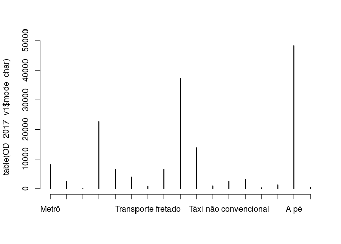
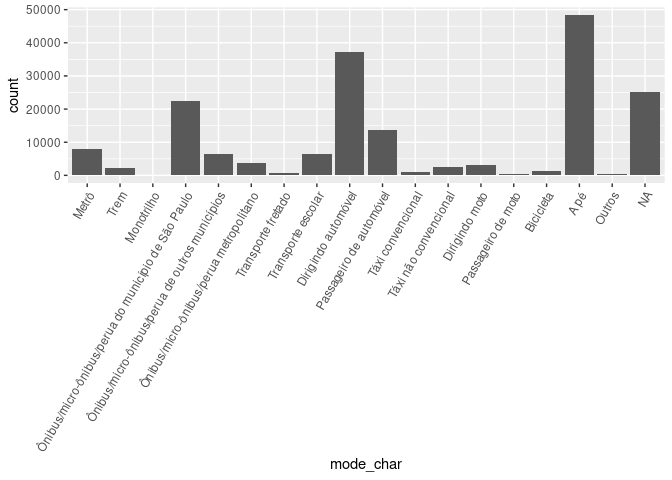
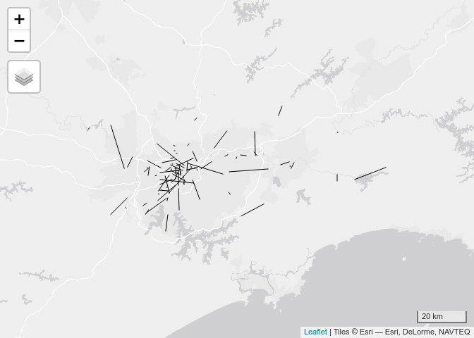

<!-- README.md is generated from README.Rmd. Please edit that file -->

# OD2017

<!-- badges: start -->
<!-- badges: end -->

The goal of this repo is to host code for the analysis of OD data from
the 2017 household travel survey in Sao Paulo. The data has the
following structure.

<table>
<thead>
<tr>
<th style="text-align:right;">
zona
</th>
<th style="text-align:right;">
muni\_dom
</th>
<th style="text-align:right;">
co\_dom\_x
</th>
<th style="text-align:right;">
co\_dom\_y
</th>
<th style="text-align:left;">
id\_dom
</th>
<th style="text-align:right;">
f\_dom
</th>
<th style="text-align:right;">
fe\_dom
</th>
<th style="text-align:right;">
dom
</th>
<th style="text-align:right;">
cd\_entre
</th>
<th style="text-align:left;">
data
</th>
<th style="text-align:right;">
tipo\_dom
</th>
<th style="text-align:right;">
agua
</th>
<th style="text-align:right;">
rua\_pavi
</th>
<th style="text-align:right;">
no\_morad
</th>
<th style="text-align:right;">
tot\_fam
</th>
<th style="text-align:left;">
id\_fam
</th>
<th style="text-align:right;">
f\_fam
</th>
<th style="text-align:right;">
fe\_fam
</th>
<th style="text-align:right;">
familia
</th>
<th style="text-align:right;">
no\_moraf
</th>
<th style="text-align:right;">
condmora
</th>
<th style="text-align:right;">
qt\_banho
</th>
<th style="text-align:right;">
qt\_empre
</th>
<th style="text-align:right;">
qt\_auto
</th>
<th style="text-align:right;">
qt\_micro
</th>
<th style="text-align:right;">
qt\_lavalou
</th>
<th style="text-align:right;">
qt\_gel1
</th>
<th style="text-align:right;">
qt\_gel2
</th>
<th style="text-align:right;">
qt\_freez
</th>
<th style="text-align:right;">
qt\_mlava
</th>
<th style="text-align:right;">
qt\_dvd
</th>
<th style="text-align:right;">
qt\_microon
</th>
<th style="text-align:right;">
qt\_moto
</th>
<th style="text-align:right;">
qt\_secarou
</th>
<th style="text-align:right;">
qt\_bicicle
</th>
<th style="text-align:right;">
nao\_dcl\_it
</th>
<th style="text-align:right;">
criteriobr
</th>
<th style="text-align:right;">
ponto\_br
</th>
<th style="text-align:right;">
ano\_auto1
</th>
<th style="text-align:right;">
ano\_auto2
</th>
<th style="text-align:right;">
ano\_auto3
</th>
<th style="text-align:right;">
renda\_fa
</th>
<th style="text-align:right;">
cd\_renfa
</th>
<th style="text-align:left;">
id\_pess
</th>
<th style="text-align:right;">
f\_pess
</th>
<th style="text-align:right;">
fe\_pess
</th>
<th style="text-align:right;">
pessoa
</th>
<th style="text-align:right;">
sit\_fam
</th>
<th style="text-align:right;">
idade
</th>
<th style="text-align:right;">
sexo
</th>
<th style="text-align:right;">
estuda
</th>
<th style="text-align:right;">
grau\_ins
</th>
<th style="text-align:right;">
cd\_ativi
</th>
<th style="text-align:right;">
co\_ren\_i
</th>
<th style="text-align:right;">
vl\_ren\_i
</th>
<th style="text-align:right;">
zona\_esc
</th>
<th style="text-align:right;">
muniesc
</th>
<th style="text-align:right;">
co\_esc\_x
</th>
<th style="text-align:right;">
co\_esc\_y
</th>
<th style="text-align:right;">
tipo\_esc
</th>
<th style="text-align:right;">
zonatra1
</th>
<th style="text-align:right;">
munitra1
</th>
<th style="text-align:right;">
co\_tr1\_x
</th>
<th style="text-align:right;">
co\_tr1\_y
</th>
<th style="text-align:right;">
trab1\_re
</th>
<th style="text-align:right;">
trabext1
</th>
<th style="text-align:right;">
ocup1
</th>
<th style="text-align:right;">
setor1
</th>
<th style="text-align:right;">
vinc1
</th>
<th style="text-align:right;">
zonatra2
</th>
<th style="text-align:right;">
munitra2
</th>
<th style="text-align:right;">
co\_tr2\_x
</th>
<th style="text-align:right;">
co\_tr2\_y
</th>
<th style="text-align:right;">
trab2\_re
</th>
<th style="text-align:right;">
trabext2
</th>
<th style="text-align:right;">
ocup2
</th>
<th style="text-align:right;">
setor2
</th>
<th style="text-align:right;">
vinc2
</th>
<th style="text-align:right;">
n\_viag
</th>
<th style="text-align:right;">
fe\_via
</th>
<th style="text-align:right;">
dia\_sem
</th>
<th style="text-align:right;">
tot\_viag
</th>
<th style="text-align:right;">
zona\_o
</th>
<th style="text-align:right;">
muni\_o
</th>
<th style="text-align:right;">
co\_o\_x
</th>
<th style="text-align:right;">
co\_o\_y
</th>
<th style="text-align:right;">
zona\_d
</th>
<th style="text-align:right;">
muni\_d
</th>
<th style="text-align:right;">
co\_d\_x
</th>
<th style="text-align:right;">
co\_d\_y
</th>
<th style="text-align:right;">
zona\_t1
</th>
<th style="text-align:right;">
muni\_t1
</th>
<th style="text-align:right;">
co\_t1\_x
</th>
<th style="text-align:right;">
co\_t1\_y
</th>
<th style="text-align:right;">
zona\_t2
</th>
<th style="text-align:right;">
muni\_t2
</th>
<th style="text-align:right;">
co\_t2\_x
</th>
<th style="text-align:right;">
co\_t2\_y
</th>
<th style="text-align:right;">
zona\_t3
</th>
<th style="text-align:right;">
muni\_t3
</th>
<th style="text-align:right;">
co\_t3\_x
</th>
<th style="text-align:right;">
co\_t3\_y
</th>
<th style="text-align:right;">
motivo\_o
</th>
<th style="text-align:right;">
motivo\_d
</th>
<th style="text-align:right;">
mot\_sres
</th>
<th style="text-align:right;">
servir\_o
</th>
<th style="text-align:right;">
servir\_d
</th>
<th style="text-align:right;">
modo1
</th>
<th style="text-align:right;">
modo2
</th>
<th style="text-align:right;">
modo3
</th>
<th style="text-align:right;">
modo4
</th>
<th style="text-align:right;">
h\_saida
</th>
<th style="text-align:right;">
min\_saida
</th>
<th style="text-align:right;">
anda\_o
</th>
<th style="text-align:right;">
h\_cheg
</th>
<th style="text-align:right;">
min\_cheg
</th>
<th style="text-align:right;">
anda\_d
</th>
<th style="text-align:right;">
duracao
</th>
<th style="text-align:right;">
modoprin
</th>
<th style="text-align:right;">
tipvg
</th>
<th style="text-align:right;">
pag\_viag
</th>
<th style="text-align:right;">
tp\_esauto
</th>
<th style="text-align:right;">
vl\_est
</th>
<th style="text-align:right;">
pe\_bici
</th>
<th style="text-align:right;">
via\_bici
</th>
<th style="text-align:right;">
tp\_esbici
</th>
<th style="text-align:right;">
distancia
</th>
<th style="text-align:right;">
id\_ordem
</th>
</tr>
</thead>
<tbody>
<tr>
<td style="text-align:right;">
1
</td>
<td style="text-align:right;">
36
</td>
<td style="text-align:right;">
333743
</td>
<td style="text-align:right;">
7394463
</td>
<td style="text-align:left;">
00010001
</td>
<td style="text-align:right;">
1
</td>
<td style="text-align:right;">
15.41667
</td>
<td style="text-align:right;">
1
</td>
<td style="text-align:right;">
1
</td>
<td style="text-align:left;">
06092017
</td>
<td style="text-align:right;">
1
</td>
<td style="text-align:right;">
1
</td>
<td style="text-align:right;">
1
</td>
<td style="text-align:right;">
2
</td>
<td style="text-align:right;">
1
</td>
<td style="text-align:left;">
000100011
</td>
<td style="text-align:right;">
1
</td>
<td style="text-align:right;">
15.41667
</td>
<td style="text-align:right;">
1
</td>
<td style="text-align:right;">
2
</td>
<td style="text-align:right;">
2
</td>
<td style="text-align:right;">
1
</td>
<td style="text-align:right;">
0
</td>
<td style="text-align:right;">
0
</td>
<td style="text-align:right;">
1
</td>
<td style="text-align:right;">
0
</td>
<td style="text-align:right;">
0
</td>
<td style="text-align:right;">
1
</td>
<td style="text-align:right;">
1
</td>
<td style="text-align:right;">
1
</td>
<td style="text-align:right;">
1
</td>
<td style="text-align:right;">
1
</td>
<td style="text-align:right;">
0
</td>
<td style="text-align:right;">
0
</td>
<td style="text-align:right;">
0
</td>
<td style="text-align:right;">
1
</td>
<td style="text-align:right;">
4
</td>
<td style="text-align:right;">
25
</td>
<td style="text-align:right;">
NA
</td>
<td style="text-align:right;">
NA
</td>
<td style="text-align:right;">
NA
</td>
<td style="text-align:right;">
2732.576
</td>
<td style="text-align:right;">
3
</td>
<td style="text-align:left;">
00010001101
</td>
<td style="text-align:right;">
1
</td>
<td style="text-align:right;">
19.53227
</td>
<td style="text-align:right;">
1
</td>
<td style="text-align:right;">
1
</td>
<td style="text-align:right;">
59
</td>
<td style="text-align:right;">
2
</td>
<td style="text-align:right;">
1
</td>
<td style="text-align:right;">
3
</td>
<td style="text-align:right;">
1
</td>
<td style="text-align:right;">
3
</td>
<td style="text-align:right;">
NA
</td>
<td style="text-align:right;">
NA
</td>
<td style="text-align:right;">
NA
</td>
<td style="text-align:right;">
NA
</td>
<td style="text-align:right;">
NA
</td>
<td style="text-align:right;">
NA
</td>
<td style="text-align:right;">
3
</td>
<td style="text-align:right;">
36
</td>
<td style="text-align:right;">
333104
</td>
<td style="text-align:right;">
7394476
</td>
<td style="text-align:right;">
2
</td>
<td style="text-align:right;">
2
</td>
<td style="text-align:right;">
4
</td>
<td style="text-align:right;">
13
</td>
<td style="text-align:right;">
1
</td>
<td style="text-align:right;">
NA
</td>
<td style="text-align:right;">
NA
</td>
<td style="text-align:right;">
NA
</td>
<td style="text-align:right;">
NA
</td>
<td style="text-align:right;">
NA
</td>
<td style="text-align:right;">
NA
</td>
<td style="text-align:right;">
NA
</td>
<td style="text-align:right;">
NA
</td>
<td style="text-align:right;">
NA
</td>
<td style="text-align:right;">
1
</td>
<td style="text-align:right;">
22.13265
</td>
<td style="text-align:right;">
3
</td>
<td style="text-align:right;">
2
</td>
<td style="text-align:right;">
1
</td>
<td style="text-align:right;">
36
</td>
<td style="text-align:right;">
333743
</td>
<td style="text-align:right;">
7394463
</td>
<td style="text-align:right;">
3
</td>
<td style="text-align:right;">
36
</td>
<td style="text-align:right;">
333104
</td>
<td style="text-align:right;">
7394476
</td>
<td style="text-align:right;">
NA
</td>
<td style="text-align:right;">
NA
</td>
<td style="text-align:right;">
NA
</td>
<td style="text-align:right;">
NA
</td>
<td style="text-align:right;">
NA
</td>
<td style="text-align:right;">
NA
</td>
<td style="text-align:right;">
NA
</td>
<td style="text-align:right;">
NA
</td>
<td style="text-align:right;">
NA
</td>
<td style="text-align:right;">
NA
</td>
<td style="text-align:right;">
NA
</td>
<td style="text-align:right;">
NA
</td>
<td style="text-align:right;">
8
</td>
<td style="text-align:right;">
3
</td>
<td style="text-align:right;">
3
</td>
<td style="text-align:right;">
2
</td>
<td style="text-align:right;">
2
</td>
<td style="text-align:right;">
16
</td>
<td style="text-align:right;">
NA
</td>
<td style="text-align:right;">
NA
</td>
<td style="text-align:right;">
NA
</td>
<td style="text-align:right;">
5
</td>
<td style="text-align:right;">
45
</td>
<td style="text-align:right;">
NA
</td>
<td style="text-align:right;">
5
</td>
<td style="text-align:right;">
55
</td>
<td style="text-align:right;">
NA
</td>
<td style="text-align:right;">
10
</td>
<td style="text-align:right;">
16
</td>
<td style="text-align:right;">
3
</td>
<td style="text-align:right;">
NA
</td>
<td style="text-align:right;">
NA
</td>
<td style="text-align:right;">
NA
</td>
<td style="text-align:right;">
1
</td>
<td style="text-align:right;">
NA
</td>
<td style="text-align:right;">
NA
</td>
<td style="text-align:right;">
639.1322
</td>
<td style="text-align:right;">
1
</td>
</tr>
<tr>
<td style="text-align:right;">
1
</td>
<td style="text-align:right;">
36
</td>
<td style="text-align:right;">
333743
</td>
<td style="text-align:right;">
7394463
</td>
<td style="text-align:left;">
00010001
</td>
<td style="text-align:right;">
0
</td>
<td style="text-align:right;">
15.41667
</td>
<td style="text-align:right;">
1
</td>
<td style="text-align:right;">
1
</td>
<td style="text-align:left;">
06092017
</td>
<td style="text-align:right;">
1
</td>
<td style="text-align:right;">
1
</td>
<td style="text-align:right;">
1
</td>
<td style="text-align:right;">
2
</td>
<td style="text-align:right;">
1
</td>
<td style="text-align:left;">
000100011
</td>
<td style="text-align:right;">
0
</td>
<td style="text-align:right;">
15.41667
</td>
<td style="text-align:right;">
1
</td>
<td style="text-align:right;">
2
</td>
<td style="text-align:right;">
2
</td>
<td style="text-align:right;">
1
</td>
<td style="text-align:right;">
0
</td>
<td style="text-align:right;">
0
</td>
<td style="text-align:right;">
1
</td>
<td style="text-align:right;">
0
</td>
<td style="text-align:right;">
0
</td>
<td style="text-align:right;">
1
</td>
<td style="text-align:right;">
1
</td>
<td style="text-align:right;">
1
</td>
<td style="text-align:right;">
1
</td>
<td style="text-align:right;">
1
</td>
<td style="text-align:right;">
0
</td>
<td style="text-align:right;">
0
</td>
<td style="text-align:right;">
0
</td>
<td style="text-align:right;">
1
</td>
<td style="text-align:right;">
4
</td>
<td style="text-align:right;">
25
</td>
<td style="text-align:right;">
NA
</td>
<td style="text-align:right;">
NA
</td>
<td style="text-align:right;">
NA
</td>
<td style="text-align:right;">
2732.576
</td>
<td style="text-align:right;">
3
</td>
<td style="text-align:left;">
00010001101
</td>
<td style="text-align:right;">
0
</td>
<td style="text-align:right;">
19.53227
</td>
<td style="text-align:right;">
1
</td>
<td style="text-align:right;">
1
</td>
<td style="text-align:right;">
59
</td>
<td style="text-align:right;">
2
</td>
<td style="text-align:right;">
1
</td>
<td style="text-align:right;">
3
</td>
<td style="text-align:right;">
1
</td>
<td style="text-align:right;">
3
</td>
<td style="text-align:right;">
NA
</td>
<td style="text-align:right;">
NA
</td>
<td style="text-align:right;">
NA
</td>
<td style="text-align:right;">
NA
</td>
<td style="text-align:right;">
NA
</td>
<td style="text-align:right;">
NA
</td>
<td style="text-align:right;">
3
</td>
<td style="text-align:right;">
36
</td>
<td style="text-align:right;">
333104
</td>
<td style="text-align:right;">
7394476
</td>
<td style="text-align:right;">
2
</td>
<td style="text-align:right;">
2
</td>
<td style="text-align:right;">
4
</td>
<td style="text-align:right;">
13
</td>
<td style="text-align:right;">
1
</td>
<td style="text-align:right;">
NA
</td>
<td style="text-align:right;">
NA
</td>
<td style="text-align:right;">
NA
</td>
<td style="text-align:right;">
NA
</td>
<td style="text-align:right;">
NA
</td>
<td style="text-align:right;">
NA
</td>
<td style="text-align:right;">
NA
</td>
<td style="text-align:right;">
NA
</td>
<td style="text-align:right;">
NA
</td>
<td style="text-align:right;">
2
</td>
<td style="text-align:right;">
22.13265
</td>
<td style="text-align:right;">
3
</td>
<td style="text-align:right;">
2
</td>
<td style="text-align:right;">
3
</td>
<td style="text-align:right;">
36
</td>
<td style="text-align:right;">
333104
</td>
<td style="text-align:right;">
7394476
</td>
<td style="text-align:right;">
1
</td>
<td style="text-align:right;">
36
</td>
<td style="text-align:right;">
333743
</td>
<td style="text-align:right;">
7394463
</td>
<td style="text-align:right;">
NA
</td>
<td style="text-align:right;">
NA
</td>
<td style="text-align:right;">
NA
</td>
<td style="text-align:right;">
NA
</td>
<td style="text-align:right;">
NA
</td>
<td style="text-align:right;">
NA
</td>
<td style="text-align:right;">
NA
</td>
<td style="text-align:right;">
NA
</td>
<td style="text-align:right;">
NA
</td>
<td style="text-align:right;">
NA
</td>
<td style="text-align:right;">
NA
</td>
<td style="text-align:right;">
NA
</td>
<td style="text-align:right;">
3
</td>
<td style="text-align:right;">
8
</td>
<td style="text-align:right;">
3
</td>
<td style="text-align:right;">
2
</td>
<td style="text-align:right;">
2
</td>
<td style="text-align:right;">
16
</td>
<td style="text-align:right;">
NA
</td>
<td style="text-align:right;">
NA
</td>
<td style="text-align:right;">
NA
</td>
<td style="text-align:right;">
15
</td>
<td style="text-align:right;">
45
</td>
<td style="text-align:right;">
NA
</td>
<td style="text-align:right;">
15
</td>
<td style="text-align:right;">
55
</td>
<td style="text-align:right;">
NA
</td>
<td style="text-align:right;">
10
</td>
<td style="text-align:right;">
16
</td>
<td style="text-align:right;">
3
</td>
<td style="text-align:right;">
NA
</td>
<td style="text-align:right;">
NA
</td>
<td style="text-align:right;">
NA
</td>
<td style="text-align:right;">
1
</td>
<td style="text-align:right;">
NA
</td>
<td style="text-align:right;">
NA
</td>
<td style="text-align:right;">
639.1322
</td>
<td style="text-align:right;">
2
</td>
</tr>
<tr>
<td style="text-align:right;">
1
</td>
<td style="text-align:right;">
36
</td>
<td style="text-align:right;">
333743
</td>
<td style="text-align:right;">
7394463
</td>
<td style="text-align:left;">
00010001
</td>
<td style="text-align:right;">
0
</td>
<td style="text-align:right;">
15.41667
</td>
<td style="text-align:right;">
1
</td>
<td style="text-align:right;">
1
</td>
<td style="text-align:left;">
06092017
</td>
<td style="text-align:right;">
1
</td>
<td style="text-align:right;">
1
</td>
<td style="text-align:right;">
1
</td>
<td style="text-align:right;">
2
</td>
<td style="text-align:right;">
1
</td>
<td style="text-align:left;">
000100011
</td>
<td style="text-align:right;">
0
</td>
<td style="text-align:right;">
15.41667
</td>
<td style="text-align:right;">
1
</td>
<td style="text-align:right;">
2
</td>
<td style="text-align:right;">
2
</td>
<td style="text-align:right;">
1
</td>
<td style="text-align:right;">
0
</td>
<td style="text-align:right;">
0
</td>
<td style="text-align:right;">
1
</td>
<td style="text-align:right;">
0
</td>
<td style="text-align:right;">
0
</td>
<td style="text-align:right;">
1
</td>
<td style="text-align:right;">
1
</td>
<td style="text-align:right;">
1
</td>
<td style="text-align:right;">
1
</td>
<td style="text-align:right;">
1
</td>
<td style="text-align:right;">
0
</td>
<td style="text-align:right;">
0
</td>
<td style="text-align:right;">
0
</td>
<td style="text-align:right;">
1
</td>
<td style="text-align:right;">
4
</td>
<td style="text-align:right;">
25
</td>
<td style="text-align:right;">
NA
</td>
<td style="text-align:right;">
NA
</td>
<td style="text-align:right;">
NA
</td>
<td style="text-align:right;">
2732.576
</td>
<td style="text-align:right;">
3
</td>
<td style="text-align:left;">
00010001102
</td>
<td style="text-align:right;">
1
</td>
<td style="text-align:right;">
16.66398
</td>
<td style="text-align:right;">
2
</td>
<td style="text-align:right;">
3
</td>
<td style="text-align:right;">
21
</td>
<td style="text-align:right;">
2
</td>
<td style="text-align:right;">
5
</td>
<td style="text-align:right;">
4
</td>
<td style="text-align:right;">
1
</td>
<td style="text-align:right;">
3
</td>
<td style="text-align:right;">
NA
</td>
<td style="text-align:right;">
84
</td>
<td style="text-align:right;">
36
</td>
<td style="text-align:right;">
329431
</td>
<td style="text-align:right;">
7395939
</td>
<td style="text-align:right;">
2
</td>
<td style="text-align:right;">
82
</td>
<td style="text-align:right;">
36
</td>
<td style="text-align:right;">
327503
</td>
<td style="text-align:right;">
7392159
</td>
<td style="text-align:right;">
2
</td>
<td style="text-align:right;">
2
</td>
<td style="text-align:right;">
4
</td>
<td style="text-align:right;">
7
</td>
<td style="text-align:right;">
2
</td>
<td style="text-align:right;">
NA
</td>
<td style="text-align:right;">
NA
</td>
<td style="text-align:right;">
NA
</td>
<td style="text-align:right;">
NA
</td>
<td style="text-align:right;">
NA
</td>
<td style="text-align:right;">
NA
</td>
<td style="text-align:right;">
NA
</td>
<td style="text-align:right;">
NA
</td>
<td style="text-align:right;">
NA
</td>
<td style="text-align:right;">
1
</td>
<td style="text-align:right;">
18.88249
</td>
<td style="text-align:right;">
3
</td>
<td style="text-align:right;">
3
</td>
<td style="text-align:right;">
1
</td>
<td style="text-align:right;">
36
</td>
<td style="text-align:right;">
333743
</td>
<td style="text-align:right;">
7394463
</td>
<td style="text-align:right;">
82
</td>
<td style="text-align:right;">
36
</td>
<td style="text-align:right;">
327503
</td>
<td style="text-align:right;">
7392159
</td>
<td style="text-align:right;">
NA
</td>
<td style="text-align:right;">
NA
</td>
<td style="text-align:right;">
NA
</td>
<td style="text-align:right;">
NA
</td>
<td style="text-align:right;">
NA
</td>
<td style="text-align:right;">
NA
</td>
<td style="text-align:right;">
NA
</td>
<td style="text-align:right;">
NA
</td>
<td style="text-align:right;">
NA
</td>
<td style="text-align:right;">
NA
</td>
<td style="text-align:right;">
NA
</td>
<td style="text-align:right;">
NA
</td>
<td style="text-align:right;">
8
</td>
<td style="text-align:right;">
3
</td>
<td style="text-align:right;">
3
</td>
<td style="text-align:right;">
2
</td>
<td style="text-align:right;">
2
</td>
<td style="text-align:right;">
1
</td>
<td style="text-align:right;">
NA
</td>
<td style="text-align:right;">
NA
</td>
<td style="text-align:right;">
NA
</td>
<td style="text-align:right;">
9
</td>
<td style="text-align:right;">
0
</td>
<td style="text-align:right;">
10
</td>
<td style="text-align:right;">
9
</td>
<td style="text-align:right;">
50
</td>
<td style="text-align:right;">
20
</td>
<td style="text-align:right;">
50
</td>
<td style="text-align:right;">
1
</td>
<td style="text-align:right;">
1
</td>
<td style="text-align:right;">
2
</td>
<td style="text-align:right;">
NA
</td>
<td style="text-align:right;">
NA
</td>
<td style="text-align:right;">
NA
</td>
<td style="text-align:right;">
NA
</td>
<td style="text-align:right;">
NA
</td>
<td style="text-align:right;">
6651.7679
</td>
<td style="text-align:right;">
3
</td>
</tr>
<tr>
<td style="text-align:right;">
1
</td>
<td style="text-align:right;">
36
</td>
<td style="text-align:right;">
333743
</td>
<td style="text-align:right;">
7394463
</td>
<td style="text-align:left;">
00010001
</td>
<td style="text-align:right;">
0
</td>
<td style="text-align:right;">
15.41667
</td>
<td style="text-align:right;">
1
</td>
<td style="text-align:right;">
1
</td>
<td style="text-align:left;">
06092017
</td>
<td style="text-align:right;">
1
</td>
<td style="text-align:right;">
1
</td>
<td style="text-align:right;">
1
</td>
<td style="text-align:right;">
2
</td>
<td style="text-align:right;">
1
</td>
<td style="text-align:left;">
000100011
</td>
<td style="text-align:right;">
0
</td>
<td style="text-align:right;">
15.41667
</td>
<td style="text-align:right;">
1
</td>
<td style="text-align:right;">
2
</td>
<td style="text-align:right;">
2
</td>
<td style="text-align:right;">
1
</td>
<td style="text-align:right;">
0
</td>
<td style="text-align:right;">
0
</td>
<td style="text-align:right;">
1
</td>
<td style="text-align:right;">
0
</td>
<td style="text-align:right;">
0
</td>
<td style="text-align:right;">
1
</td>
<td style="text-align:right;">
1
</td>
<td style="text-align:right;">
1
</td>
<td style="text-align:right;">
1
</td>
<td style="text-align:right;">
1
</td>
<td style="text-align:right;">
0
</td>
<td style="text-align:right;">
0
</td>
<td style="text-align:right;">
0
</td>
<td style="text-align:right;">
1
</td>
<td style="text-align:right;">
4
</td>
<td style="text-align:right;">
25
</td>
<td style="text-align:right;">
NA
</td>
<td style="text-align:right;">
NA
</td>
<td style="text-align:right;">
NA
</td>
<td style="text-align:right;">
2732.576
</td>
<td style="text-align:right;">
3
</td>
<td style="text-align:left;">
00010001102
</td>
<td style="text-align:right;">
0
</td>
<td style="text-align:right;">
16.66398
</td>
<td style="text-align:right;">
2
</td>
<td style="text-align:right;">
3
</td>
<td style="text-align:right;">
21
</td>
<td style="text-align:right;">
2
</td>
<td style="text-align:right;">
5
</td>
<td style="text-align:right;">
4
</td>
<td style="text-align:right;">
1
</td>
<td style="text-align:right;">
3
</td>
<td style="text-align:right;">
NA
</td>
<td style="text-align:right;">
84
</td>
<td style="text-align:right;">
36
</td>
<td style="text-align:right;">
329431
</td>
<td style="text-align:right;">
7395939
</td>
<td style="text-align:right;">
2
</td>
<td style="text-align:right;">
82
</td>
<td style="text-align:right;">
36
</td>
<td style="text-align:right;">
327503
</td>
<td style="text-align:right;">
7392159
</td>
<td style="text-align:right;">
2
</td>
<td style="text-align:right;">
2
</td>
<td style="text-align:right;">
4
</td>
<td style="text-align:right;">
7
</td>
<td style="text-align:right;">
2
</td>
<td style="text-align:right;">
NA
</td>
<td style="text-align:right;">
NA
</td>
<td style="text-align:right;">
NA
</td>
<td style="text-align:right;">
NA
</td>
<td style="text-align:right;">
NA
</td>
<td style="text-align:right;">
NA
</td>
<td style="text-align:right;">
NA
</td>
<td style="text-align:right;">
NA
</td>
<td style="text-align:right;">
NA
</td>
<td style="text-align:right;">
2
</td>
<td style="text-align:right;">
18.88249
</td>
<td style="text-align:right;">
3
</td>
<td style="text-align:right;">
3
</td>
<td style="text-align:right;">
82
</td>
<td style="text-align:right;">
36
</td>
<td style="text-align:right;">
327503
</td>
<td style="text-align:right;">
7392159
</td>
<td style="text-align:right;">
84
</td>
<td style="text-align:right;">
36
</td>
<td style="text-align:right;">
329431
</td>
<td style="text-align:right;">
7395939
</td>
<td style="text-align:right;">
93
</td>
<td style="text-align:right;">
36
</td>
<td style="text-align:right;">
329861
</td>
<td style="text-align:right;">
7397268
</td>
<td style="text-align:right;">
NA
</td>
<td style="text-align:right;">
NA
</td>
<td style="text-align:right;">
NA
</td>
<td style="text-align:right;">
NA
</td>
<td style="text-align:right;">
NA
</td>
<td style="text-align:right;">
NA
</td>
<td style="text-align:right;">
NA
</td>
<td style="text-align:right;">
NA
</td>
<td style="text-align:right;">
3
</td>
<td style="text-align:right;">
4
</td>
<td style="text-align:right;">
4
</td>
<td style="text-align:right;">
2
</td>
<td style="text-align:right;">
2
</td>
<td style="text-align:right;">
1
</td>
<td style="text-align:right;">
4
</td>
<td style="text-align:right;">
NA
</td>
<td style="text-align:right;">
NA
</td>
<td style="text-align:right;">
17
</td>
<td style="text-align:right;">
0
</td>
<td style="text-align:right;">
20
</td>
<td style="text-align:right;">
18
</td>
<td style="text-align:right;">
0
</td>
<td style="text-align:right;">
1
</td>
<td style="text-align:right;">
60
</td>
<td style="text-align:right;">
1
</td>
<td style="text-align:right;">
1
</td>
<td style="text-align:right;">
2
</td>
<td style="text-align:right;">
NA
</td>
<td style="text-align:right;">
NA
</td>
<td style="text-align:right;">
NA
</td>
<td style="text-align:right;">
NA
</td>
<td style="text-align:right;">
NA
</td>
<td style="text-align:right;">
4243.2987
</td>
<td style="text-align:right;">
4
</td>
</tr>
<tr>
<td style="text-align:right;">
1
</td>
<td style="text-align:right;">
36
</td>
<td style="text-align:right;">
333743
</td>
<td style="text-align:right;">
7394463
</td>
<td style="text-align:left;">
00010001
</td>
<td style="text-align:right;">
0
</td>
<td style="text-align:right;">
15.41667
</td>
<td style="text-align:right;">
1
</td>
<td style="text-align:right;">
1
</td>
<td style="text-align:left;">
06092017
</td>
<td style="text-align:right;">
1
</td>
<td style="text-align:right;">
1
</td>
<td style="text-align:right;">
1
</td>
<td style="text-align:right;">
2
</td>
<td style="text-align:right;">
1
</td>
<td style="text-align:left;">
000100011
</td>
<td style="text-align:right;">
0
</td>
<td style="text-align:right;">
15.41667
</td>
<td style="text-align:right;">
1
</td>
<td style="text-align:right;">
2
</td>
<td style="text-align:right;">
2
</td>
<td style="text-align:right;">
1
</td>
<td style="text-align:right;">
0
</td>
<td style="text-align:right;">
0
</td>
<td style="text-align:right;">
1
</td>
<td style="text-align:right;">
0
</td>
<td style="text-align:right;">
0
</td>
<td style="text-align:right;">
1
</td>
<td style="text-align:right;">
1
</td>
<td style="text-align:right;">
1
</td>
<td style="text-align:right;">
1
</td>
<td style="text-align:right;">
1
</td>
<td style="text-align:right;">
0
</td>
<td style="text-align:right;">
0
</td>
<td style="text-align:right;">
0
</td>
<td style="text-align:right;">
1
</td>
<td style="text-align:right;">
4
</td>
<td style="text-align:right;">
25
</td>
<td style="text-align:right;">
NA
</td>
<td style="text-align:right;">
NA
</td>
<td style="text-align:right;">
NA
</td>
<td style="text-align:right;">
2732.576
</td>
<td style="text-align:right;">
3
</td>
<td style="text-align:left;">
00010001102
</td>
<td style="text-align:right;">
0
</td>
<td style="text-align:right;">
16.66398
</td>
<td style="text-align:right;">
2
</td>
<td style="text-align:right;">
3
</td>
<td style="text-align:right;">
21
</td>
<td style="text-align:right;">
2
</td>
<td style="text-align:right;">
5
</td>
<td style="text-align:right;">
4
</td>
<td style="text-align:right;">
1
</td>
<td style="text-align:right;">
3
</td>
<td style="text-align:right;">
NA
</td>
<td style="text-align:right;">
84
</td>
<td style="text-align:right;">
36
</td>
<td style="text-align:right;">
329431
</td>
<td style="text-align:right;">
7395939
</td>
<td style="text-align:right;">
2
</td>
<td style="text-align:right;">
82
</td>
<td style="text-align:right;">
36
</td>
<td style="text-align:right;">
327503
</td>
<td style="text-align:right;">
7392159
</td>
<td style="text-align:right;">
2
</td>
<td style="text-align:right;">
2
</td>
<td style="text-align:right;">
4
</td>
<td style="text-align:right;">
7
</td>
<td style="text-align:right;">
2
</td>
<td style="text-align:right;">
NA
</td>
<td style="text-align:right;">
NA
</td>
<td style="text-align:right;">
NA
</td>
<td style="text-align:right;">
NA
</td>
<td style="text-align:right;">
NA
</td>
<td style="text-align:right;">
NA
</td>
<td style="text-align:right;">
NA
</td>
<td style="text-align:right;">
NA
</td>
<td style="text-align:right;">
NA
</td>
<td style="text-align:right;">
3
</td>
<td style="text-align:right;">
18.88249
</td>
<td style="text-align:right;">
3
</td>
<td style="text-align:right;">
3
</td>
<td style="text-align:right;">
84
</td>
<td style="text-align:right;">
36
</td>
<td style="text-align:right;">
329431
</td>
<td style="text-align:right;">
7395939
</td>
<td style="text-align:right;">
1
</td>
<td style="text-align:right;">
36
</td>
<td style="text-align:right;">
333743
</td>
<td style="text-align:right;">
7394463
</td>
<td style="text-align:right;">
NA
</td>
<td style="text-align:right;">
NA
</td>
<td style="text-align:right;">
NA
</td>
<td style="text-align:right;">
NA
</td>
<td style="text-align:right;">
NA
</td>
<td style="text-align:right;">
NA
</td>
<td style="text-align:right;">
NA
</td>
<td style="text-align:right;">
NA
</td>
<td style="text-align:right;">
NA
</td>
<td style="text-align:right;">
NA
</td>
<td style="text-align:right;">
NA
</td>
<td style="text-align:right;">
NA
</td>
<td style="text-align:right;">
4
</td>
<td style="text-align:right;">
8
</td>
<td style="text-align:right;">
4
</td>
<td style="text-align:right;">
2
</td>
<td style="text-align:right;">
2
</td>
<td style="text-align:right;">
12
</td>
<td style="text-align:right;">
NA
</td>
<td style="text-align:right;">
NA
</td>
<td style="text-align:right;">
NA
</td>
<td style="text-align:right;">
22
</td>
<td style="text-align:right;">
50
</td>
<td style="text-align:right;">
1
</td>
<td style="text-align:right;">
23
</td>
<td style="text-align:right;">
30
</td>
<td style="text-align:right;">
1
</td>
<td style="text-align:right;">
40
</td>
<td style="text-align:right;">
12
</td>
<td style="text-align:right;">
2
</td>
<td style="text-align:right;">
NA
</td>
<td style="text-align:right;">
NA
</td>
<td style="text-align:right;">
NA
</td>
<td style="text-align:right;">
NA
</td>
<td style="text-align:right;">
NA
</td>
<td style="text-align:right;">
NA
</td>
<td style="text-align:right;">
4557.6222
</td>
<td style="text-align:right;">
5
</td>
</tr>
<tr>
<td style="text-align:right;">
1
</td>
<td style="text-align:right;">
36
</td>
<td style="text-align:right;">
333814
</td>
<td style="text-align:right;">
7394428
</td>
<td style="text-align:left;">
00010002
</td>
<td style="text-align:right;">
1
</td>
<td style="text-align:right;">
15.41667
</td>
<td style="text-align:right;">
2
</td>
<td style="text-align:right;">
1
</td>
<td style="text-align:left;">
06092017
</td>
<td style="text-align:right;">
1
</td>
<td style="text-align:right;">
1
</td>
<td style="text-align:right;">
1
</td>
<td style="text-align:right;">
4
</td>
<td style="text-align:right;">
1
</td>
<td style="text-align:left;">
000100021
</td>
<td style="text-align:right;">
1
</td>
<td style="text-align:right;">
15.41667
</td>
<td style="text-align:right;">
1
</td>
<td style="text-align:right;">
4
</td>
<td style="text-align:right;">
1
</td>
<td style="text-align:right;">
1
</td>
<td style="text-align:right;">
0
</td>
<td style="text-align:right;">
0
</td>
<td style="text-align:right;">
0
</td>
<td style="text-align:right;">
0
</td>
<td style="text-align:right;">
1
</td>
<td style="text-align:right;">
0
</td>
<td style="text-align:right;">
0
</td>
<td style="text-align:right;">
1
</td>
<td style="text-align:right;">
1
</td>
<td style="text-align:right;">
0
</td>
<td style="text-align:right;">
0
</td>
<td style="text-align:right;">
0
</td>
<td style="text-align:right;">
0
</td>
<td style="text-align:right;">
1
</td>
<td style="text-align:right;">
5
</td>
<td style="text-align:right;">
18
</td>
<td style="text-align:right;">
NA
</td>
<td style="text-align:right;">
NA
</td>
<td style="text-align:right;">
NA
</td>
<td style="text-align:right;">
3200.000
</td>
<td style="text-align:right;">
1
</td>
<td style="text-align:left;">
00010002101
</td>
<td style="text-align:right;">
1
</td>
<td style="text-align:right;">
19.53227
</td>
<td style="text-align:right;">
1
</td>
<td style="text-align:right;">
1
</td>
<td style="text-align:right;">
37
</td>
<td style="text-align:right;">
2
</td>
<td style="text-align:right;">
1
</td>
<td style="text-align:right;">
4
</td>
<td style="text-align:right;">
1
</td>
<td style="text-align:right;">
1
</td>
<td style="text-align:right;">
1000
</td>
<td style="text-align:right;">
NA
</td>
<td style="text-align:right;">
NA
</td>
<td style="text-align:right;">
NA
</td>
<td style="text-align:right;">
NA
</td>
<td style="text-align:right;">
NA
</td>
<td style="text-align:right;">
1
</td>
<td style="text-align:right;">
36
</td>
<td style="text-align:right;">
333453
</td>
<td style="text-align:right;">
7394501
</td>
<td style="text-align:right;">
2
</td>
<td style="text-align:right;">
2
</td>
<td style="text-align:right;">
6
</td>
<td style="text-align:right;">
4
</td>
<td style="text-align:right;">
1
</td>
<td style="text-align:right;">
NA
</td>
<td style="text-align:right;">
NA
</td>
<td style="text-align:right;">
NA
</td>
<td style="text-align:right;">
NA
</td>
<td style="text-align:right;">
NA
</td>
<td style="text-align:right;">
NA
</td>
<td style="text-align:right;">
NA
</td>
<td style="text-align:right;">
NA
</td>
<td style="text-align:right;">
NA
</td>
<td style="text-align:right;">
1
</td>
<td style="text-align:right;">
22.13265
</td>
<td style="text-align:right;">
3
</td>
<td style="text-align:right;">
4
</td>
<td style="text-align:right;">
1
</td>
<td style="text-align:right;">
36
</td>
<td style="text-align:right;">
333814
</td>
<td style="text-align:right;">
7394428
</td>
<td style="text-align:right;">
1
</td>
<td style="text-align:right;">
36
</td>
<td style="text-align:right;">
333453
</td>
<td style="text-align:right;">
7394501
</td>
<td style="text-align:right;">
NA
</td>
<td style="text-align:right;">
NA
</td>
<td style="text-align:right;">
NA
</td>
<td style="text-align:right;">
NA
</td>
<td style="text-align:right;">
NA
</td>
<td style="text-align:right;">
NA
</td>
<td style="text-align:right;">
NA
</td>
<td style="text-align:right;">
NA
</td>
<td style="text-align:right;">
NA
</td>
<td style="text-align:right;">
NA
</td>
<td style="text-align:right;">
NA
</td>
<td style="text-align:right;">
NA
</td>
<td style="text-align:right;">
8
</td>
<td style="text-align:right;">
2
</td>
<td style="text-align:right;">
2
</td>
<td style="text-align:right;">
2
</td>
<td style="text-align:right;">
2
</td>
<td style="text-align:right;">
16
</td>
<td style="text-align:right;">
NA
</td>
<td style="text-align:right;">
NA
</td>
<td style="text-align:right;">
NA
</td>
<td style="text-align:right;">
8
</td>
<td style="text-align:right;">
0
</td>
<td style="text-align:right;">
NA
</td>
<td style="text-align:right;">
8
</td>
<td style="text-align:right;">
10
</td>
<td style="text-align:right;">
NA
</td>
<td style="text-align:right;">
10
</td>
<td style="text-align:right;">
16
</td>
<td style="text-align:right;">
3
</td>
<td style="text-align:right;">
NA
</td>
<td style="text-align:right;">
NA
</td>
<td style="text-align:right;">
NA
</td>
<td style="text-align:right;">
1
</td>
<td style="text-align:right;">
NA
</td>
<td style="text-align:right;">
NA
</td>
<td style="text-align:right;">
368.3069
</td>
<td style="text-align:right;">
6
</td>
</tr>
</tbody>
</table>

The dataset contains nearly 200k rows and 128 columns.

    #> [1] 183092    128

Column names are as follows:

    #>   [1] "zona"       "muni_dom"   "co_dom_x"   "co_dom_y"   "id_dom"    
    #>   [6] "f_dom"      "fe_dom"     "dom"        "cd_entre"   "data"      
    #>  [11] "tipo_dom"   "agua"       "rua_pavi"   "no_morad"   "tot_fam"   
    #>  [16] "id_fam"     "f_fam"      "fe_fam"     "familia"    "no_moraf"  
    #>  [21] "condmora"   "qt_banho"   "qt_empre"   "qt_auto"    "qt_micro"  
    #>  [26] "qt_lavalou" "qt_gel1"    "qt_gel2"    "qt_freez"   "qt_mlava"  
    #>  [31] "qt_dvd"     "qt_microon" "qt_moto"    "qt_secarou" "qt_bicicle"
    #>  [36] "nao_dcl_it" "criteriobr" "ponto_br"   "ano_auto1"  "ano_auto2" 
    #>  [41] "ano_auto3"  "renda_fa"   "cd_renfa"   "id_pess"    "f_pess"    
    #>  [46] "fe_pess"    "pessoa"     "sit_fam"    "idade"      "sexo"      
    #>  [51] "estuda"     "grau_ins"   "cd_ativi"   "co_ren_i"   "vl_ren_i"  
    #>  [56] "zona_esc"   "muniesc"    "co_esc_x"   "co_esc_y"   "tipo_esc"  
    #>  [61] "zonatra1"   "munitra1"   "co_tr1_x"   "co_tr1_y"   "trab1_re"  
    #>  [66] "trabext1"   "ocup1"      "setor1"     "vinc1"      "zonatra2"  
    #>  [71] "munitra2"   "co_tr2_x"   "co_tr2_y"   "trab2_re"   "trabext2"  
    #>  [76] "ocup2"      "setor2"     "vinc2"      "n_viag"     "fe_via"    
    #>  [81] "dia_sem"    "tot_viag"   "zona_o"     "muni_o"     "co_o_x"    
    #>  [86] "co_o_y"     "zona_d"     "muni_d"     "co_d_x"     "co_d_y"    
    #>  [91] "zona_t1"    "muni_t1"    "co_t1_x"    "co_t1_y"    "zona_t2"   
    #>  [96] "muni_t2"    "co_t2_x"    "co_t2_y"    "zona_t3"    "muni_t3"   
    #> [101] "co_t3_x"    "co_t3_y"    "motivo_o"   "motivo_d"   "mot_sres"  
    #> [106] "servir_o"   "servir_d"   "modo1"      "modo2"      "modo3"     
    #> [111] "modo4"      "h_saida"    "min_saida"  "anda_o"     "h_cheg"    
    #> [116] "min_cheg"   "anda_d"     "duracao"    "modoprin"   "tipvg"     
    #> [121] "pag_viag"   "tp_esauto"  "vl_est"     "pe_bici"    "via_bici"  
    #> [126] "tp_esbici"  "distancia"  "id_ordem"

Key columns are `modo1`:

    #> 
    #> Labels:
    #>  value                                               label
    #>      1                                               Metrô
    #>      2                                                Trem
    #>      3                                          Monotrilho
    #>      4 Ônibus/micro-ônibus/perua do município de São Paulo
    #>      5      Ônibus/micro-ônibus/perua de outros municípios
    #>      6             Ônibus/micro-ônibus/perua metropolitano
    #>      7                                  Transporte fretado
    #>      8                                  Transporte escolar
    #>      9                                 Dirigindo automóvel
    #>     10                             Passageiro de automóvel
    #>     11                                   Táxi convencional
    #>     12                               Táxi não convencional
    #>     13                                      Dirigindo moto
    #>     14                                  Passageiro de moto
    #>     15                                           Bicicleta
    #>     16                                                A pé
    #>     17                                              Outros

<!-- --><!-- -->

<!-- A quick overview of the data is shown below: -->

We can map a sample of the data as follows:

    #>      co_o_x           co_o_y            co_d_x           co_d_y       
    #>  Min.   :295034   Min.   :7370625   Min.   :294581   Min.   :7375274  
    #>  1st Qu.:326134   1st Qu.:7390746   1st Qu.:325462   1st Qu.:7389626  
    #>  Median :330651   Median :7395244   Median :330684   Median :7394994  
    #>  Mean   :336034   Mean   :7394347   Mean   :335293   Mean   :7394305  
    #>  3rd Qu.:338522   3rd Qu.:7398495   3rd Qu.:337528   3rd Qu.:7397539  
    #>  Max.   :413010   Max.   :7420580   Max.   :400793   Max.   :7416888
    #> [1] 19.62695

<!-- -->
