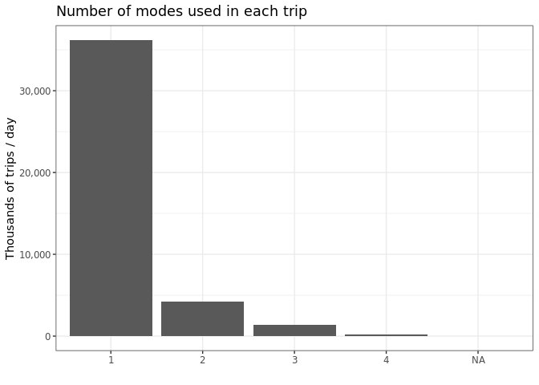

Exploring OD2017 data
================

I create this separated document to be the main reference on the
exploratory data analysis. The data set is at the trip level and I take
advantage of the survey design and use the expansion factor (for the
trips) in all the graphs and analysis here. The survey implies that
there are 4.200666^{7} trips/day in the São Paulo Metro Region.

### Key variables

The data set contains a lot of socioeconomic variables. Since our
interest relies on trips, flows and mode choices, the analyses so far
are at the trip level. In this context, the variables that contain a the
modes used in each trip are the main ones (`modo1`, `modo2`, `modo3`,
and `modo4`). There is also the coordinates for each residence
(`co_dom_x` and `co_dom_y`) and workplaces (`co_tr1_x` and `co_tr1_y`),
and obviously the origin and destination zones and coordinates
(e.g. `zona_o`, `co_o_x`, `co_o_y`) and euclidean distance. As you can
see in the graph below, the vast majority of trips are made using just
one mode. I use `modo1`in the remaining graphs.

<!-- -->

### Different ways of defining modes

I aggregate the different names used for similar things. And this is the
resulting distribution of trips for each mode.

<!-- -->

### Recategorisation of modes

I tried two different recategorisations (see code for the choices).The
first is based on the “vehicle” itself, and the other relies on the
“role” of the individual while in the trip.

<!-- -->

<!-- -->
