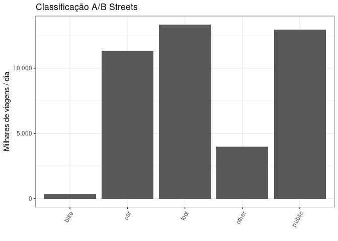
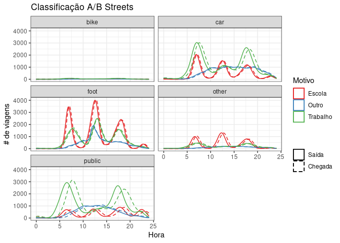

Exploring OD2017 data
================

I create this separated document to be the main reference on the
exploratory data analysis. The data set is at the trip level and I take
advantage of the survey design and use the expansion factor (for the
trips) in all the graphs and analysis here. The survey implies that
there are 4.200666^{7} trips/day in the São Paulo Metro Region.

### Key variables

The data set contains a lot of socioeconomic variables. Since our
interest relies on trips, flows and mode choices, the analyses so far
are at the trip level. In this context, the variables that contain a the
modes used in each trip are the main ones (`modo1`, `modo2`, `modo3`,
and `modo4`). There is also the coordinates for each residence
(`co_dom_x` and `co_dom_y`) and workplaces (`co_tr1_x` and `co_tr1_y`),
and obviously the origin and destination zones and coordinates
(e.g. `zona_o`, `co_o_x`, `co_o_y`) and euclidean distance. As you can
see in the graph below, the vast majority of trips are made using just
one mode. I use the main mode used in the trip (`modoprin`) in the
remaining graphs.

<!-- -->

### Different ways of defining modes

I aggregate the different names used for similar things. And this is the
resulting distribution of trips for each mode.

<!-- -->

### Recategorisation of modes

I tried two different recategorisations (see code for the choices).The
first is based on the “vehicle” itself, and the other relies on the
“role” of the individual while in the trip.

<!-- -->

<!-- -->

### Basic temporal analysis

We can look at the number of trips recorded in different days of the
week as follows:

    #> # A tibble: 6 × 2
    #>              dia_sem mean_weight
    #>            <dbl+lbl>       <dbl>
    #> 1  2 [Segunda-feira]        270.
    #> 2  3 [Terça-feira]          264.
    #> 3  4 [Quarta-feira]         261.
    #> 4  5 [Quinta-feira]         276.
    #> 5  6 [Sexta-feira]          263.
    #> 6 NA                         NA

    #> Warning: Removed 1 row(s) containing missing values (geom_path).

    #> Warning: Removed 1 row(s) containing missing values (geom_path).

<!-- -->

### Basic geographic analysis

Here I plot the main zones of origin and destination using the total
number of trips – always using the survey’s expansion factor. It is
interesting to note that there is no centrality pattern when we look at
the main Zones of Destination. Maybe we should restrict the analysis to
specific types of trips (e.g., commute strictly defined). I checked
these results with the official Tables and they are the same in terms of
the main zones of origin and destination.

<!-- -->

Plotting only the São Paulo City.There is no pattern of spatial
centrality in destinations either.

<!-- -->

I then remove the intrazonal trips and plot the same maps to test
whether these patterns come from intrazonal trips only. It seems that is
not the case.

<!-- -->

And the same conclusion applies for São Paulo City…

<!-- -->

#### Active travels and trip patterns

Following the Bristol examples in Robin’s book now. But maybe we should
zoom in the São Paulo City.

    #> Creating centroids representing desire line start and end points.

<!-- -->

There are still too many zones…

    #> Creating centroids representing desire line start and end points.
    #> Legend labels were too wide. Therefore, legend.text.size has been set to 0.47. Increase legend.width (argument of tm_layout) to make the legend wider and therefore the labels larger.

<!-- -->
