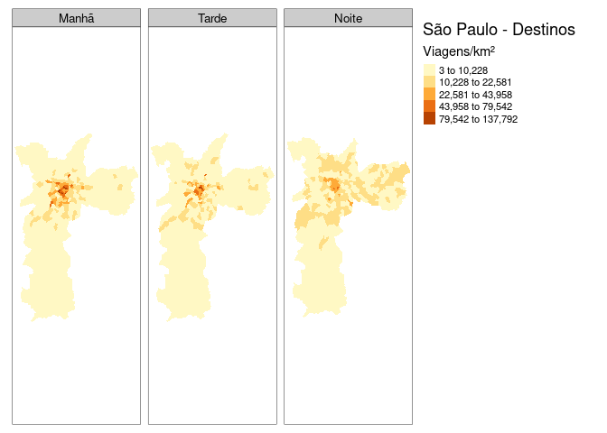

Exploring OD2017 data
================

I create this separated document to be the main reference on the
exploratory data analysis. The data set is at the trip level and I take
advantage of the survey design and use the expansion factor (for the
trips) in all the graphs and analysis here. The survey implies that
there are 4.200666^{7} trips/day in the São Paulo Metro Region.

### Key variables

The data set contains a lot of socioeconomic variables. Since our
interest relies on trips, flows and mode choices, the analyses so far
are at the trip level. In this context, the variables that contain a the
modes used in each trip are the main ones (`modo1`, `modo2`, `modo3`,
and `modo4`). There is also the coordinates for each residence
(`co_dom_x` and `co_dom_y`) and workplaces (`co_tr1_x` and `co_tr1_y`),
and obviously the origin and destination zones and coordinates
(e.g. `zona_o`, `co_o_x`, `co_o_y`) and euclidean distance. As you can
see in the graph below, the vast majority of trips are made using just
one mode. I use the main mode used in the trip (`modoprin`) in the
remaining graphs.

### Recategorisation of modes

I tried two different recategorisations (see code for the choices).The
first is based on the “vehicle” itself, and the other relies on the
“role” of the individual while in the trip.

<!-- -->

Now the A/B Streets classification (foot, bike, car, public transport
and other):

<!-- -->

Now the mode share by distance (using the first recategorisation). The
average trips’ distance is 5305.0981626.

    #> `summarise()` has grouped output by 'dist_bands'. You can override using the
    #> `.groups` argument.

<!-- -->

    #> `summarise()` has grouped output by 'dist_bands'. You can override using the
    #> `.groups` argument.

<!-- -->

    #> `summarise()` has grouped output by 'dist_bands'. You can override using the
    #> `.groups` argument.

<!-- -->

Number of trips / reason

    #> # A tibble: 11 × 2
    #>                          motivo         n
    #>                       <dbl+lbl>     <dbl>
    #>  1  1 [Trabalho Indústria]       2924869.
    #>  2  2 [Trabalho Comércio]        3523074.
    #>  3  3 [Trabalho Serviços]       12064328.
    #>  4  4 [Escola/Educação]         14670928.
    #>  5  5 [Compras]                  1929215.
    #>  6  6 [Médico/Dentista/Saúde]    1827264.
    #>  7  7 [Recreação/Visitas/Lazer]  1816626.
    #>  8  9 [Procurar Emprego]          180089.
    #>  9 10 [Assuntos Pessoais]        2496314.
    #> 10 11 [Refeição]                  573954.
    #> 11 NA                                  0

    #> # A tibble: 3 × 2
    #>   motivo_simples         n
    #>   <chr>              <dbl>
    #> 1 Escola         14670928.
    #> 2 Outro           8823462.
    #> 3 Trabalho       18512270.

### Basic temporal analysis

Distributions of trips in the day

<!-- -->

<!-- -->

### Basic geographic analysis (now with times )

Here I plot the main zones of origin and destination using the total
number of trips – always using the survey’s expansion factor. It is
interesting to note that there is no centrality pattern when we look at
the main Zones of Destination. Maybe we should restrict the analysis to
specific types of trips (e.g., commute strictly defined). I checked
these results with the official Tables and they are the same in terms of
the main zones of origin and destination.

    #> Using year 2010
    #> Downloading: 1.6 kB     Downloading: 1.6 kB     Downloading: 1.6 kB     Downloading: 1.6 kB     Downloading: 9.7 kB     Downloading: 9.7 kB     Downloading: 9.7 kB     Downloading: 9.7 kB     Downloading: 9.7 kB     Downloading: 9.7 kB     Downloading: 18 kB     Downloading: 18 kB     Downloading: 18 kB     Downloading: 18 kB     Downloading: 18 kB     Downloading: 18 kB     Downloading: 26 kB     Downloading: 26 kB     Downloading: 26 kB     Downloading: 26 kB     Downloading: 26 kB     Downloading: 26 kB     Downloading: 34 kB     Downloading: 34 kB     Downloading: 34 kB     Downloading: 34 kB     Downloading: 34 kB     Downloading: 34 kB     Downloading: 42 kB     Downloading: 42 kB     Downloading: 42 kB     Downloading: 42 kB     Downloading: 42 kB     Downloading: 42 kB     Downloading: 50 kB     Downloading: 50 kB     Downloading: 50 kB     Downloading: 50 kB     Downloading: 50 kB     Downloading: 50 kB     Downloading: 58 kB     Downloading: 58 kB     Downloading: 58 kB     Downloading: 58 kB     Downloading: 58 kB     Downloading: 58 kB     Downloading: 66 kB     Downloading: 66 kB     Downloading: 66 kB     Downloading: 66 kB     Downloading: 66 kB     Downloading: 66 kB     Downloading: 74 kB     Downloading: 74 kB     Downloading: 74 kB     Downloading: 74 kB     Downloading: 74 kB     Downloading: 74 kB     Downloading: 83 kB     Downloading: 83 kB     Downloading: 83 kB     Downloading: 83 kB     Downloading: 83 kB     Downloading: 83 kB     Downloading: 91 kB     Downloading: 91 kB     Downloading: 91 kB     Downloading: 91 kB     Downloading: 91 kB     Downloading: 91 kB     Downloading: 99 kB     Downloading: 99 kB     Downloading: 99 kB     Downloading: 99 kB     Downloading: 99 kB     Downloading: 99 kB     Downloading: 110 kB     Downloading: 110 kB     Downloading: 110 kB     Downloading: 110 kB     Downloading: 110 kB     Downloading: 110 kB     Downloading: 110 kB     Downloading: 110 kB     Downloading: 110 kB     Downloading: 110 kB     Downloading: 110 kB     Downloading: 110 kB     Downloading: 120 kB     Downloading: 120 kB     Downloading: 120 kB     Downloading: 120 kB     Downloading: 120 kB     Downloading: 120 kB     Downloading: 130 kB     Downloading: 130 kB     Downloading: 130 kB     Downloading: 130 kB     Downloading: 130 kB     Downloading: 130 kB     Downloading: 140 kB     Downloading: 140 kB     Downloading: 140 kB     Downloading: 140 kB     Downloading: 140 kB     Downloading: 140 kB     Downloading: 150 kB     Downloading: 150 kB     Downloading: 150 kB     Downloading: 150 kB     Downloading: 150 kB     Downloading: 150 kB     Downloading: 160 kB     Downloading: 160 kB     Downloading: 160 kB     Downloading: 160 kB     Downloading: 160 kB     Downloading: 160 kB     Downloading: 160 kB     Downloading: 160 kB     Downloading: 160 kB     Downloading: 160 kB     Downloading: 160 kB     Downloading: 160 kB     Downloading: 170 kB     Downloading: 170 kB     Downloading: 170 kB     Downloading: 170 kB     Downloading: 170 kB     Downloading: 170 kB     Downloading: 180 kB     Downloading: 180 kB     Downloading: 180 kB     Downloading: 180 kB     Downloading: 180 kB     Downloading: 180 kB     Downloading: 190 kB     Downloading: 190 kB     Downloading: 190 kB     Downloading: 190 kB     Downloading: 190 kB     Downloading: 190 kB     Downloading: 200 kB     Downloading: 200 kB     Downloading: 200 kB     Downloading: 200 kB     Downloading: 200 kB     Downloading: 200 kB     Downloading: 200 kB     Downloading: 200 kB     Downloading: 200 kB     Downloading: 200 kB     Downloading: 200 kB     Downloading: 200 kB     Downloading: 210 kB     Downloading: 210 kB     Downloading: 210 kB     Downloading: 210 kB     Downloading: 210 kB     Downloading: 210 kB     Downloading: 220 kB     Downloading: 220 kB     Downloading: 220 kB     Downloading: 220 kB     Downloading: 220 kB     Downloading: 220 kB     Downloading: 230 kB     Downloading: 230 kB     Downloading: 230 kB     Downloading: 230 kB     Downloading: 230 kB     Downloading: 230 kB     Downloading: 240 kB     Downloading: 240 kB     Downloading: 240 kB     Downloading: 240 kB     Downloading: 240 kB     Downloading: 240 kB     Downloading: 240 kB     Downloading: 240 kB     Downloading: 240 kB     Downloading: 240 kB     Downloading: 240 kB     Downloading: 240 kB     Downloading: 250 kB     Downloading: 250 kB     Downloading: 250 kB     Downloading: 250 kB     Downloading: 250 kB     Downloading: 250 kB     Downloading: 260 kB     Downloading: 260 kB     Downloading: 260 kB     Downloading: 260 kB     Downloading: 260 kB     Downloading: 260 kB     Downloading: 270 kB     Downloading: 270 kB     Downloading: 270 kB     Downloading: 270 kB     Downloading: 270 kB     Downloading: 270 kB     Downloading: 280 kB     Downloading: 280 kB     Downloading: 280 kB     Downloading: 280 kB     Downloading: 280 kB     Downloading: 280 kB     Downloading: 280 kB     Downloading: 280 kB     Downloading: 280 kB     Downloading: 280 kB     Downloading: 280 kB     Downloading: 280 kB     Downloading: 290 kB     Downloading: 290 kB     Downloading: 290 kB     Downloading: 290 kB     Downloading: 290 kB     Downloading: 290 kB     Downloading: 300 kB     Downloading: 300 kB     Downloading: 300 kB     Downloading: 300 kB     Downloading: 300 kB     Downloading: 300 kB     Downloading: 310 kB     Downloading: 310 kB     Downloading: 310 kB     Downloading: 310 kB     Downloading: 310 kB     Downloading: 310 kB     Downloading: 320 kB     Downloading: 320 kB     Downloading: 320 kB     Downloading: 320 kB     Downloading: 320 kB     Downloading: 320 kB     Downloading: 330 kB     Downloading: 330 kB     Downloading: 330 kB     Downloading: 330 kB     Downloading: 330 kB     Downloading: 330 kB     Downloading: 330 kB     Downloading: 330 kB     Downloading: 330 kB     Downloading: 330 kB     Downloading: 330 kB     Downloading: 330 kB     Downloading: 340 kB     Downloading: 340 kB     Downloading: 340 kB     Downloading: 340 kB     Downloading: 340 kB     Downloading: 340 kB     Downloading: 350 kB     Downloading: 350 kB     Downloading: 350 kB     Downloading: 350 kB     Downloading: 350 kB     Downloading: 350 kB     Downloading: 360 kB     Downloading: 360 kB     Downloading: 360 kB     Downloading: 360 kB     Downloading: 360 kB     Downloading: 360 kB     Downloading: 370 kB     Downloading: 370 kB     Downloading: 370 kB     Downloading: 370 kB     Downloading: 370 kB     Downloading: 370 kB     Downloading: 370 kB     Downloading: 370 kB     Downloading: 370 kB     Downloading: 370 kB     Downloading: 370 kB     Downloading: 370 kB     Downloading: 380 kB     Downloading: 380 kB     Downloading: 380 kB     Downloading: 380 kB     Downloading: 380 kB     Downloading: 380 kB     Downloading: 390 kB     Downloading: 390 kB     Downloading: 390 kB     Downloading: 390 kB     Downloading: 390 kB     Downloading: 390 kB     Downloading: 400 kB     Downloading: 400 kB     Downloading: 400 kB     Downloading: 400 kB     Downloading: 400 kB     Downloading: 400 kB     Downloading: 410 kB     Downloading: 410 kB     Downloading: 410 kB     Downloading: 410 kB     Downloading: 410 kB     Downloading: 410 kB     Downloading: 410 kB     Downloading: 410 kB     Downloading: 410 kB     Downloading: 410 kB     Downloading: 410 kB     Downloading: 410 kB     Downloading: 420 kB     Downloading: 420 kB     Downloading: 420 kB     Downloading: 420 kB     Downloading: 420 kB     Downloading: 420 kB     Downloading: 420 kB     Downloading: 420 kB     Downloading: 430 kB     Downloading: 430 kB     Downloading: 430 kB     Downloading: 430 kB     Downloading: 430 kB     Downloading: 430 kB     Downloading: 440 kB     Downloading: 440 kB     Downloading: 440 kB     Downloading: 440 kB     Downloading: 440 kB     Downloading: 440 kB     Downloading: 450 kB     Downloading: 450 kB     Downloading: 450 kB     Downloading: 450 kB     Downloading: 450 kB     Downloading: 450 kB     Downloading: 450 kB     Downloading: 450 kB     Downloading: 450 kB     Downloading: 450 kB     Downloading: 450 kB     Downloading: 450 kB     Downloading: 460 kB     Downloading: 460 kB     Downloading: 460 kB     Downloading: 460 kB     Downloading: 460 kB     Downloading: 460 kB     Downloading: 470 kB     Downloading: 470 kB     Downloading: 470 kB     Downloading: 470 kB     Downloading: 470 kB     Downloading: 470 kB     Downloading: 480 kB     Downloading: 480 kB     Downloading: 480 kB     Downloading: 480 kB     Downloading: 480 kB     Downloading: 480 kB     Downloading: 490 kB     Downloading: 490 kB     Downloading: 490 kB     Downloading: 490 kB     Downloading: 490 kB     Downloading: 490 kB     Downloading: 500 kB     Downloading: 500 kB     Downloading: 500 kB     Downloading: 500 kB     Downloading: 500 kB     Downloading: 500 kB     Downloading: 500 kB     Downloading: 500 kB     Downloading: 500 kB     Downloading: 500 kB     Downloading: 500 kB     Downloading: 500 kB     Downloading: 510 kB     Downloading: 510 kB     Downloading: 510 kB     Downloading: 510 kB     Downloading: 510 kB     Downloading: 510 kB     Downloading: 520 kB     Downloading: 520 kB     Downloading: 520 kB     Downloading: 520 kB     Downloading: 520 kB     Downloading: 520 kB     Downloading: 530 kB     Downloading: 530 kB     Downloading: 530 kB     Downloading: 530 kB     Downloading: 530 kB     Downloading: 530 kB     Downloading: 540 kB     Downloading: 540 kB     Downloading: 540 kB     Downloading: 540 kB     Downloading: 540 kB     Downloading: 540 kB     Downloading: 540 kB     Downloading: 540 kB     Downloading: 540 kB     Downloading: 540 kB     Downloading: 540 kB     Downloading: 540 kB     Downloading: 550 kB     Downloading: 550 kB     Downloading: 550 kB     Downloading: 550 kB     Downloading: 550 kB     Downloading: 550 kB     Downloading: 560 kB     Downloading: 560 kB     Downloading: 560 kB     Downloading: 560 kB     Downloading: 560 kB     Downloading: 560 kB     Downloading: 570 kB     Downloading: 570 kB     Downloading: 570 kB     Downloading: 570 kB     Downloading: 570 kB     Downloading: 570 kB     Downloading: 580 kB     Downloading: 580 kB     Downloading: 580 kB     Downloading: 580 kB     Downloading: 580 kB     Downloading: 580 kB     Downloading: 580 kB     Downloading: 580 kB     Downloading: 580 kB     Downloading: 580 kB     Downloading: 580 kB     Downloading: 580 kB     Downloading: 590 kB     Downloading: 590 kB     Downloading: 590 kB     Downloading: 590 kB     Downloading: 590 kB     Downloading: 590 kB     Downloading: 600 kB     Downloading: 600 kB     Downloading: 600 kB     Downloading: 600 kB     Downloading: 600 kB     Downloading: 600 kB     Downloading: 610 kB     Downloading: 610 kB     Downloading: 610 kB     Downloading: 610 kB     Downloading: 610 kB     Downloading: 610 kB     Downloading: 620 kB     Downloading: 620 kB     Downloading: 620 kB     Downloading: 620 kB     Downloading: 620 kB     Downloading: 620 kB     Downloading: 630 kB     Downloading: 630 kB     Downloading: 630 kB     Downloading: 630 kB     Downloading: 630 kB     Downloading: 630 kB     Downloading: 630 kB     Downloading: 630 kB     Downloading: 630 kB     Downloading: 630 kB     Downloading: 630 kB     Downloading: 630 kB     Downloading: 640 kB     Downloading: 640 kB     Downloading: 640 kB     Downloading: 640 kB     Downloading: 640 kB     Downloading: 640 kB     Downloading: 650 kB     Downloading: 650 kB     Downloading: 650 kB     Downloading: 650 kB     Downloading: 650 kB     Downloading: 650 kB     Downloading: 660 kB     Downloading: 660 kB     Downloading: 660 kB     Downloading: 660 kB     Downloading: 660 kB     Downloading: 660 kB     Downloading: 670 kB     Downloading: 670 kB     Downloading: 670 kB     Downloading: 670 kB     Downloading: 670 kB     Downloading: 670 kB     Downloading: 670 kB     Downloading: 670 kB     Downloading: 670 kB     Downloading: 670 kB     Downloading: 670 kB     Downloading: 670 kB     Downloading: 680 kB     Downloading: 680 kB     Downloading: 680 kB     Downloading: 680 kB     Downloading: 680 kB     Downloading: 680 kB     Downloading: 690 kB     Downloading: 690 kB     Downloading: 690 kB     Downloading: 690 kB     Downloading: 690 kB     Downloading: 690 kB     Downloading: 700 kB     Downloading: 700 kB     Downloading: 700 kB     Downloading: 700 kB     Downloading: 700 kB     Downloading: 700 kB     Downloading: 710 kB     Downloading: 710 kB     Downloading: 710 kB     Downloading: 710 kB     Downloading: 710 kB     Downloading: 710 kB     Downloading: 710 kB     Downloading: 710 kB     Downloading: 710 kB     Downloading: 710 kB     Downloading: 710 kB     Downloading: 710 kB     Downloading: 720 kB     Downloading: 720 kB     Downloading: 720 kB     Downloading: 720 kB     Downloading: 720 kB     Downloading: 720 kB     Downloading: 730 kB     Downloading: 730 kB     Downloading: 730 kB     Downloading: 730 kB     Downloading: 730 kB     Downloading: 730 kB     Downloading: 740 kB     Downloading: 740 kB     Downloading: 740 kB     Downloading: 740 kB     Downloading: 740 kB     Downloading: 740 kB     Downloading: 750 kB     Downloading: 750 kB     Downloading: 750 kB     Downloading: 750 kB     Downloading: 750 kB     Downloading: 750 kB     Downloading: 750 kB     Downloading: 750 kB     Downloading: 750 kB     Downloading: 750 kB     Downloading: 750 kB     Downloading: 750 kB     Downloading: 760 kB     Downloading: 760 kB     Downloading: 760 kB     Downloading: 760 kB     Downloading: 760 kB     Downloading: 760 kB     Downloading: 770 kB     Downloading: 770 kB     Downloading: 770 kB     Downloading: 770 kB     Downloading: 770 kB     Downloading: 770 kB     Downloading: 780 kB     Downloading: 780 kB     Downloading: 780 kB     Downloading: 780 kB     Downloading: 780 kB     Downloading: 780 kB     Downloading: 790 kB     Downloading: 790 kB     Downloading: 790 kB     Downloading: 790 kB     Downloading: 790 kB     Downloading: 790 kB     Downloading: 800 kB     Downloading: 800 kB     Downloading: 800 kB     Downloading: 800 kB     Downloading: 800 kB     Downloading: 800 kB     Downloading: 800 kB     Downloading: 800 kB     Downloading: 800 kB     Downloading: 800 kB     Downloading: 800 kB     Downloading: 800 kB     Downloading: 810 kB     Downloading: 810 kB     Downloading: 810 kB     Downloading: 810 kB     Downloading: 810 kB     Downloading: 810 kB     Downloading: 820 kB     Downloading: 820 kB     Downloading: 820 kB     Downloading: 820 kB     Downloading: 820 kB     Downloading: 820 kB     Downloading: 830 kB     Downloading: 830 kB     Downloading: 830 kB     Downloading: 830 kB     Downloading: 830 kB     Downloading: 830 kB     Downloading: 840 kB     Downloading: 840 kB     Downloading: 840 kB     Downloading: 840 kB     Downloading: 840 kB     Downloading: 840 kB     Downloading: 840 kB     Downloading: 840 kB     Downloading: 840 kB     Downloading: 840 kB     Downloading: 840 kB     Downloading: 840 kB     Downloading: 850 kB     Downloading: 850 kB     Downloading: 850 kB     Downloading: 850 kB     Downloading: 850 kB     Downloading: 850 kB     Downloading: 860 kB     Downloading: 860 kB     Downloading: 860 kB     Downloading: 860 kB     Downloading: 860 kB     Downloading: 860 kB     Downloading: 870 kB     Downloading: 870 kB     Downloading: 870 kB     Downloading: 870 kB     Downloading: 870 kB     Downloading: 870 kB     Downloading: 880 kB     Downloading: 880 kB     Downloading: 880 kB     Downloading: 880 kB     Downloading: 880 kB     Downloading: 880 kB     Downloading: 880 kB     Downloading: 880 kB     Downloading: 880 kB     Downloading: 880 kB     Downloading: 880 kB     Downloading: 880 kB     Downloading: 890 kB     Downloading: 890 kB     Downloading: 890 kB     Downloading: 890 kB     Downloading: 890 kB     Downloading: 890 kB     Downloading: 900 kB     Downloading: 900 kB     Downloading: 900 kB     Downloading: 900 kB     Downloading: 900 kB     Downloading: 900 kB     Downloading: 910 kB     Downloading: 910 kB     Downloading: 910 kB     Downloading: 910 kB     Downloading: 910 kB     Downloading: 910 kB     Downloading: 920 kB     Downloading: 920 kB     Downloading: 920 kB     Downloading: 920 kB     Downloading: 920 kB     Downloading: 920 kB     Downloading: 920 kB     Downloading: 920 kB     Downloading: 920 kB     Downloading: 920 kB     Downloading: 920 kB     Downloading: 920 kB     Downloading: 930 kB     Downloading: 930 kB     Downloading: 930 kB     Downloading: 930 kB     Downloading: 930 kB     Downloading: 930 kB     Downloading: 940 kB     Downloading: 940 kB     Downloading: 940 kB     Downloading: 940 kB     Downloading: 940 kB     Downloading: 940 kB     Downloading: 950 kB     Downloading: 950 kB     Downloading: 950 kB     Downloading: 950 kB     Downloading: 950 kB     Downloading: 950 kB     Downloading: 960 kB     Downloading: 960 kB     Downloading: 960 kB     Downloading: 960 kB     Downloading: 960 kB     Downloading: 960 kB     Downloading: 970 kB     Downloading: 970 kB     Downloading: 970 kB     Downloading: 970 kB     Downloading: 970 kB     Downloading: 970 kB     Downloading: 970 kB     Downloading: 970 kB     Downloading: 970 kB     Downloading: 970 kB     Downloading: 970 kB     Downloading: 970 kB     Downloading: 980 kB     Downloading: 980 kB     Downloading: 980 kB     Downloading: 980 kB     Downloading: 980 kB     Downloading: 980 kB     Downloading: 990 kB     Downloading: 990 kB     Downloading: 990 kB     Downloading: 990 kB     Downloading: 990 kB     Downloading: 990 kB     Downloading: 1,000 kB     Downloading: 1,000 kB     Downloading: 1,000 kB     Downloading: 1,000 kB     Downloading: 1,000 kB     Downloading: 1,000 kB     Downloading: 1 MB     Downloading: 1 MB     Downloading: 1 MB     Downloading: 1 MB     Downloading: 1 MB     Downloading: 1 MB     Downloading: 1 MB     Downloading: 1 MB     Downloading: 1 MB     Downloading: 1 MB     Downloading: 1 MB     Downloading: 1 MB     Downloading: 1 MB     Downloading: 1 MB     Downloading: 1 MB     Downloading: 1 MB     Downloading: 1 MB     Downloading: 1 MB     Downloading: 1 MB     Downloading: 1 MB     Downloading: 1 MB     Downloading: 1 MB     Downloading: 1 MB     Downloading: 1 MB     Downloading: 1 MB     Downloading: 1 MB     Downloading: 1 MB     Downloading: 1 MB     Downloading: 1 MB     Downloading: 1 MB     Downloading: 1 MB     Downloading: 1 MB     Downloading: 1 MB     Downloading: 1 MB     Downloading: 1 MB     Downloading: 1 MB     Downloading: 1.1 MB     Downloading: 1.1 MB     Downloading: 1.1 MB     Downloading: 1.1 MB     Downloading: 1.1 MB     Downloading: 1.1 MB     Downloading: 1.1 MB     Downloading: 1.1 MB     Downloading: 1.1 MB     Downloading: 1.1 MB     Downloading: 1.1 MB     Downloading: 1.1 MB     Downloading: 1.1 MB     Downloading: 1.1 MB     Downloading: 1.1 MB     Downloading: 1.1 MB     Downloading: 1.1 MB     Downloading: 1.1 MB     Downloading: 1.1 MB     Downloading: 1.1 MB     Downloading: 1.1 MB     Downloading: 1.1 MB     Downloading: 1.1 MB     Downloading: 1.1 MB     Downloading: 1.1 MB     Downloading: 1.1 MB     Downloading: 1.1 MB     Downloading: 1.1 MB     Downloading: 1.1 MB     Downloading: 1.1 MB     Downloading: 1.1 MB     Downloading: 1.1 MB     Downloading: 1.1 MB     Downloading: 1.1 MB     Downloading: 1.1 MB     Downloading: 1.1 MB     Downloading: 1.1 MB     Downloading: 1.1 MB     Downloading: 1.1 MB     Downloading: 1.1 MB     Downloading: 1.1 MB     Downloading: 1.1 MB     Downloading: 1.1 MB     Downloading: 1.1 MB     Downloading: 1.1 MB     Downloading: 1.1 MB     Downloading: 1.1 MB     Downloading: 1.1 MB     Downloading: 1.1 MB     Downloading: 1.1 MB     Downloading: 1.1 MB     Downloading: 1.1 MB     Downloading: 1.1 MB     Downloading: 1.1 MB     Downloading: 1.1 MB     Downloading: 1.1 MB     Downloading: 1.1 MB     Downloading: 1.1 MB     Downloading: 1.1 MB     Downloading: 1.1 MB     Downloading: 1.1 MB     Downloading: 1.1 MB     Downloading: 1.1 MB     Downloading: 1.1 MB     Downloading: 1.1 MB     Downloading: 1.1 MB     Downloading: 1.1 MB     Downloading: 1.1 MB     Downloading: 1.1 MB     Downloading: 1.1 MB     Downloading: 1.1 MB     Downloading: 1.1 MB     Downloading: 1.2 MB     Downloading: 1.2 MB     Downloading: 1.2 MB     Downloading: 1.2 MB     Downloading: 1.2 MB     Downloading: 1.2 MB     Downloading: 1.2 MB     Downloading: 1.2 MB     Downloading: 1.2 MB     Downloading: 1.2 MB     Downloading: 1.2 MB     Downloading: 1.2 MB     Downloading: 1.2 MB     Downloading: 1.2 MB     Downloading: 1.2 MB     Downloading: 1.2 MB     Downloading: 1.2 MB     Downloading: 1.2 MB     Downloading: 1.2 MB     Downloading: 1.2 MB     Downloading: 1.2 MB     Downloading: 1.2 MB     Downloading: 1.2 MB     Downloading: 1.2 MB     Downloading: 1.2 MB     Downloading: 1.2 MB     Downloading: 1.2 MB     Downloading: 1.2 MB     Downloading: 1.2 MB     Downloading: 1.2 MB     Downloading: 1.2 MB     Downloading: 1.2 MB     Downloading: 1.2 MB     Downloading: 1.2 MB     Downloading: 1.2 MB     Downloading: 1.2 MB     Downloading: 1.2 MB     Downloading: 1.2 MB     Downloading: 1.2 MB     Downloading: 1.2 MB     Downloading: 1.2 MB     Downloading: 1.2 MB     Downloading: 1.2 MB     Downloading: 1.2 MB     Downloading: 1.2 MB     Downloading: 1.2 MB     Downloading: 1.2 MB     Downloading: 1.2 MB     Downloading: 1.2 MB     Downloading: 1.2 MB     Downloading: 1.2 MB     Downloading: 1.2 MB     Downloading: 1.2 MB     Downloading: 1.2 MB     Downloading: 1.2 MB     Downloading: 1.2 MB     Downloading: 1.2 MB     Downloading: 1.2 MB     Downloading: 1.2 MB     Downloading: 1.2 MB     Downloading: 1.2 MB     Downloading: 1.2 MB     Downloading: 1.2 MB     Downloading: 1.2 MB     Downloading: 1.2 MB     Downloading: 1.2 MB     Downloading: 1.2 MB     Downloading: 1.2 MB     Downloading: 1.2 MB     Downloading: 1.2 MB     Downloading: 1.2 MB     Downloading: 1.2 MB     Downloading: 1.2 MB     Downloading: 1.2 MB     Downloading: 1.2 MB     Downloading: 1.2 MB     Downloading: 1.2 MB     Downloading: 1.2 MB     Downloading: 1.3 MB     Downloading: 1.3 MB     Downloading: 1.3 MB     Downloading: 1.3 MB     Downloading: 1.3 MB     Downloading: 1.3 MB     Downloading: 1.3 MB     Downloading: 1.3 MB     Downloading: 1.3 MB     Downloading: 1.3 MB     Downloading: 1.3 MB     Downloading: 1.3 MB     Downloading: 1.3 MB     Downloading: 1.3 MB     Downloading: 1.3 MB     Downloading: 1.3 MB     Downloading: 1.3 MB     Downloading: 1.3 MB     Downloading: 1.3 MB     Downloading: 1.3 MB     Downloading: 1.3 MB     Downloading: 1.3 MB     Downloading: 1.3 MB     Downloading: 1.3 MB     Downloading: 1.3 MB     Downloading: 1.3 MB     Downloading: 1.3 MB     Downloading: 1.3 MB     Downloading: 1.3 MB     Downloading: 1.3 MB     Downloading: 1.3 MB     Downloading: 1.3 MB     Downloading: 1.3 MB     Downloading: 1.3 MB     Downloading: 1.3 MB     Downloading: 1.3 MB     Downloading: 1.3 MB     Downloading: 1.3 MB     Downloading: 1.3 MB     Downloading: 1.3 MB     Downloading: 1.3 MB     Downloading: 1.3 MB     Downloading: 1.3 MB     Downloading: 1.3 MB     Downloading: 1.3 MB     Downloading: 1.3 MB     Downloading: 1.3 MB     Downloading: 1.3 MB     Downloading: 1.3 MB     Downloading: 1.3 MB     Downloading: 1.3 MB     Downloading: 1.3 MB     Downloading: 1.3 MB     Downloading: 1.3 MB     Downloading: 1.3 MB     Downloading: 1.3 MB     Downloading: 1.3 MB     Downloading: 1.3 MB     Downloading: 1.3 MB     Downloading: 1.3 MB     Downloading: 1.3 MB     Downloading: 1.3 MB     Downloading: 1.3 MB     Downloading: 1.3 MB     Downloading: 1.3 MB     Downloading: 1.3 MB     Downloading: 1.3 MB     Downloading: 1.3 MB     Downloading: 1.3 MB     Downloading: 1.3 MB     Downloading: 1.3 MB     Downloading: 1.3 MB     Downloading: 1.4 MB     Downloading: 1.4 MB     Downloading: 1.4 MB     Downloading: 1.4 MB     Downloading: 1.4 MB     Downloading: 1.4 MB     Downloading: 1.4 MB     Downloading: 1.4 MB     Downloading: 1.4 MB     Downloading: 1.4 MB     Downloading: 1.4 MB     Downloading: 1.4 MB     Downloading: 1.4 MB     Downloading: 1.4 MB     Downloading: 1.4 MB     Downloading: 1.4 MB     Downloading: 1.4 MB     Downloading: 1.4 MB     Downloading: 1.4 MB     Downloading: 1.4 MB     Downloading: 1.4 MB     Downloading: 1.4 MB     Downloading: 1.4 MB     Downloading: 1.4 MB     Downloading: 1.4 MB     Downloading: 1.4 MB     Downloading: 1.4 MB     Downloading: 1.4 MB     Downloading: 1.4 MB     Downloading: 1.4 MB     Downloading: 1.4 MB     Downloading: 1.4 MB     Downloading: 1.4 MB     Downloading: 1.4 MB     Downloading: 1.4 MB     Downloading: 1.4 MB     Downloading: 1.4 MB     Downloading: 1.4 MB     Downloading: 1.4 MB     Downloading: 1.4 MB     Downloading: 1.4 MB     Downloading: 1.4 MB     Downloading: 1.4 MB     Downloading: 1.4 MB     Downloading: 1.4 MB     Downloading: 1.4 MB     Downloading: 1.4 MB     Downloading: 1.4 MB     Downloading: 1.4 MB     Downloading: 1.4 MB     Downloading: 1.4 MB     Downloading: 1.4 MB     Downloading: 1.4 MB     Downloading: 1.4 MB     Downloading: 1.4 MB     Downloading: 1.4 MB     Downloading: 1.4 MB     Downloading: 1.4 MB     Downloading: 1.4 MB     Downloading: 1.4 MB     Downloading: 1.4 MB     Downloading: 1.4 MB

Plotting the origin zones by time.

<!-- -->

Plotting the destination zones by time.

<!-- -->

Looking at the São Paulo City. First, the origins.

<!-- -->

Now, the destinations for São Paulo City.

<!-- -->

#### Distances by zone of residence

    #> `summarise()` has grouped output by 'id_pess', 'zona'. You can override using
    #> the `.groups` argument.
    #> `summarise()` has grouped output by 'zona'. You can override using the
    #> `.groups` argument.
    #> `summarise()` has grouped output by 'id_pess', 'zona'. You can override using
    #> the `.groups` argument.
    #> `summarise()` has grouped output by 'zona'. You can override using the
    #> `.groups` argument.

Looking at the population data here.

Comparing the population with the Census (2010) using census tracts.

Some people left São Paulo City, but is not significant relative to the
total.

#### Active travels and trip patterns (Desire lines)

(I removed the previous visualizations since they were not saying
anything about the data.)

Walking and cycling are highly concentrated in few OD pairs (\>90% in
1,000 pairs for walking and \>90% in 500 pairs for cycling). Car trips
are more dispersed, we have \>90% of trips in 10,000 pairs.

Bike trips:

Foot trips:

Car trips, still too many lines (10,000) to account for \>92% of total
car trips.

Using the first 5,000 OD pairs, we have \>78% of all car trips.

Using the biggest 1,000 pairs, we have \>45% of all car trips.

### Main routes by mode (takes a long time here) – rewriting this part.

### Plotting the routes

Load the routes I calculated.

something wrong here, check later…

### Infrastructure data (São Paulo municipality only)

obs.: very strange behavior here: st_buffer + st_make_valid makes one
single polygon very small. without st_buffer, R does not even plot – “C
stack usage too close to …”. These operations seems to be necessary in
the other geometries.

OD pairs that generate the most intensive usage of space (kms traveled
in the routes) have more area allocated to the transport mode (both foot
and car)

Very strong pattern here.

Some outliers in this graph, may be worth to check later…
