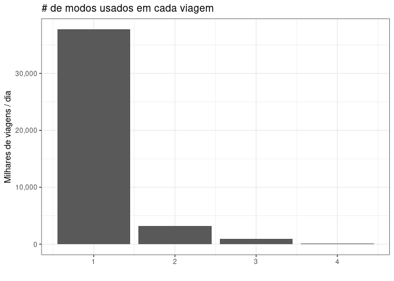
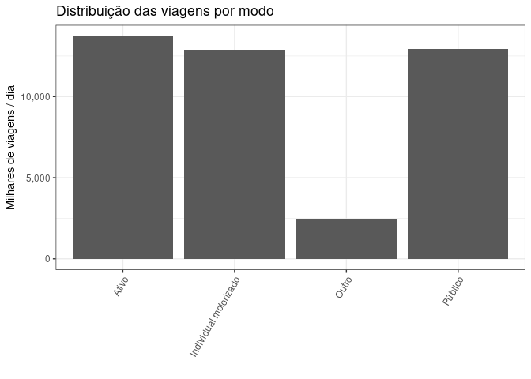
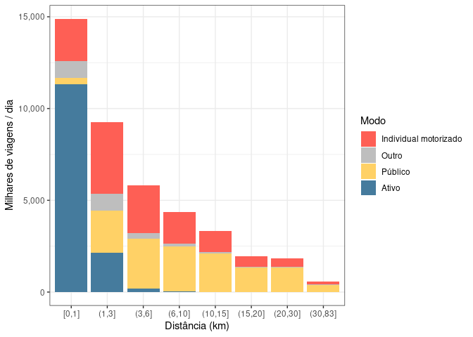
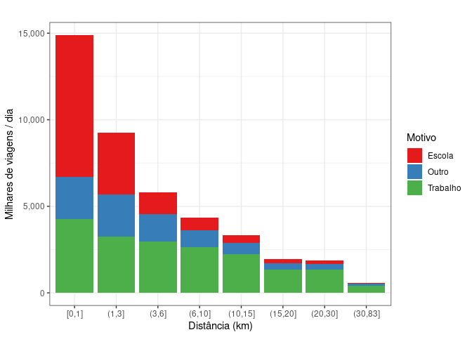
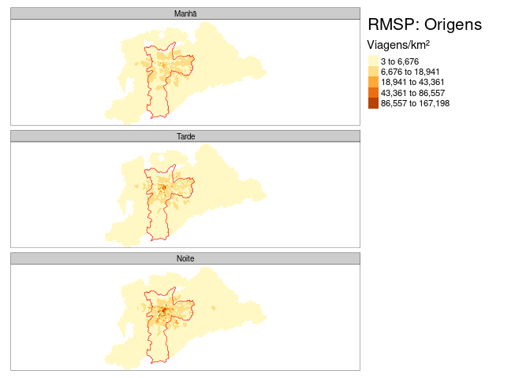

Exploring OD2017 data
================

I create this separated document to be the main reference on the
exploratory data analysis. The data set is at the trip level and I take
advantage of the survey design and use the expansion factor (for the
trips) in all the graphs and analysis here. The survey implies that
there are 4.200666^{7} trips/day in the São Paulo Metro Region.

### Key variables

The data set contains a lot of socioeconomic variables. Since our
interest relies on trips, flows and mode choices, the analyses so far
are at the trip level. In this context, the variables that contain a the
modes used in each trip are the main ones (`modo1`, `modo2`, `modo3`,
and `modo4`). There is also the coordinates for each residence
(`co_dom_x` and `co_dom_y`) and workplaces (`co_tr1_x` and `co_tr1_y`),
and obviously the origin and destination zones and coordinates
(e.g. `zona_o`, `co_o_x`, `co_o_y`) and euclidean distance. As you can
see in the graph below, the vast majority of trips are made using just
one mode. I use the main mode used in the trip (`modoprin`) in the
remaining graphs.

<!-- -->

### Different ways of defining modes

I aggregate the different names used for similar things. And this is the
resulting distribution of trips for each mode.

<!-- -->

### Recategorisation of modes

I tried two different recategorisations (see code for the choices).The
first is based on the “vehicle” itself, and the other relies on the
“role” of the individual while in the trip.

<!-- -->

<!-- -->

Now the A/B Streets classification (foot, bike, car, public transport
and other):

<!-- -->

Now the mode share by distance (using the first recategorisation). The
average trips’ distance is 5305.0981626.

    #> `summarise()` has grouped output by 'dist_bands'. You can override using the `.groups` argument.

<!-- -->

### Basic temporal analysis

Distributions of trips in the day.

    #> Warning: Removed 1 row(s) containing missing values (geom_path).

    #> Warning: Removed 1 row(s) containing missing values (geom_path).

<!-- -->

Looking at the same graph but taking into account the minutes
(i.e. using hour as a continuous variable)

<!-- -->

### Basic geographic analysis (now with times )

Here I plot the main zones of origin and destination using the total
number of trips – always using the survey’s expansion factor. It is
interesting to note that there is no centrality pattern when we look at
the main Zones of Destination. Maybe we should restrict the analysis to
specific types of trips (e.g., commute strictly defined). I checked
these results with the official Tables and they are the same in terms of
the main zones of origin and destination.

Plotting the origin zones by time.

<!-- -->

Plotting the destination zones by time.

<!-- -->

Looking at the São Paulo City. First, the origins.

<!-- -->

Now, the destinations for São Paulo City.

<!-- -->

#### Active travels and trip patterns

(I removed the previous visualizations since they were not saying
anything about the data.)

Walking and cycling are highly concentrated in few OD pairs (&gt;90% in
1,000 pairs for walking and &gt;90% in 500 pairs for cycling.). Car
trips are more dispersed, we have &gt;90% of trips in 10,000 pairs.

Bike trips:

    #> Creating centroids representing desire line start and end points.

<!-- -->

Foot trips:

    #> Creating centroids representing desire line start and end points.

<!-- -->

Car trips, still too many lines (10,000) to account for &gt;92% of total
car trips.

    #> Creating centroids representing desire line start and end points.

<!-- -->

Using the first 5,000 OD pairs, we have &gt;78% of all car trips.

    #> Creating centroids representing desire line start and end points.

<!-- -->

Using the biggest 1,000 pairs, we have &gt;45% of all car trips.

    #> Creating centroids representing desire line start and end points.

<!-- -->
